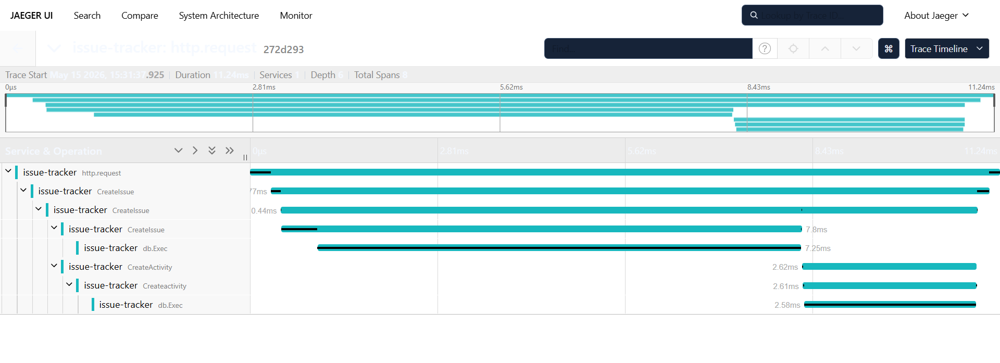

# IssueTracker

A production-quality issue tracking REST API built in Go, demonstrating clean Domain-Driven Design architecture with full OpenTelemetry observability — traces, metrics, and structured logging.

## Why I Built This

Built to develop the kind of deep understanding where I can walk into any production codebase and it starts making sense— the architecture decisions, the tradeoffs, the failure modes. OpenTelemetry was the natural next layer: once you understand how a system is built, you want to see inside it while it runs. That curiosity led me to the CNCF ecosystem and the OpenTelemetry Go compile instrumentation project.

## Table of Contents

- [Overview](#overview)
- [Tech Stack](#techstack)
- [Architecture](#architecture)
- [Domain Model](#domain-model)
- [OpenTelemetry Observability](#opentelemetry-observability)
- [Domain Events](#domain-events)
- [Getting Started](#getting-started)
- [Project Structure](#project-structure)

---

## Overview

IssueTracker is a RESTful API for managing software issues, built to explore and demonstrate:

- **Domain-Driven Design (DDD)** — clean separation of domain logic, application services, and infrastructure
- **OpenTelemetry** — distributed tracing, Prometheus metrics, and structured logging wired together
- **Domain Events** — automatic audit trail via an `EventPublisher` interface, no manual activity logging
- **JWT Authentication** — stateless auth with userID propagated through Go's `context.Context`

---
## Tech Stack
- Go 1.25
- PostgreSQL
- chi (HTTP router)
- OpenTelemetry (traces + metrics)
- Jaeger (trace backend)
- Prometheus (metrics backend)
- JWT (auth)
- Docker + Docker Compose

## Architecture

The project follows a strict layered architecture:

```
handlers/        → HTTP layer — decodes requests, calls services, writes responses
service/         → Application layer — orchestrates domain logic and publishes events
domain/          → Core domain — entities, repository interfaces, domain events
internal/
  postgres/      → Repository implementations — SQL queries with OTel spans
  telemetry/     → OTel setup — tracer, meter, logger, middleware
  auth/          → JWT generation, validation, and middleware
```

Each layer only depends inward — handlers know about services, services know about domain, domain knows nothing about infrastructure.

### Dependency Flow

```
HTTP Request
  
MetricsMiddleware (starts span, records metrics)
    
JWTMiddleware (injects userID into context)

Handler (decodes request body)

Service (domain logic + publishes event)

Repository (SQL query with OTel span)

ActivityService.Publish (auto-creates audit record)
```

---

## Domain Model

### Entities

**Issue** — the core entity. Has a status lifecycle (`OPEN` → `IN_PROGRESS` → `CLOSED`) enforced through domain methods:

```go
issue.Start(user)   // only assignee can start
issue.Close(user)   // only assignee can close
issue.ReOpen(user)  // only assignee can reopen
```

**User** — has a `Role` (`ADMIN`, `MAINTAINER`, `DEVELOPER`) with `ChangeRole()` tracking when the role changed via `ChangedRoleAt`.

**Comment** — belongs to an issue and a user. `UserId` is always sourced from JWT context, never from the request body.

**Label** — can be attached to multiple issues via a join table (`issue_labels`). Many-to-many relationship.

**Activity** — the audit log. Never created manually — always emitted automatically via domain events.

### Issue Status Transitions

```
OPEN ──→ IN_PROGRESS ──→ CLOSED
          ↑                 │
          └─────────────────┘ (reopen)
```

All transitions are validated in the domain layer and return typed domain errors.

## Tests

Domain logic is fully tested — every state transition, authorization check, and error case has explicit coverage

## OpenTelemetry Observability

The project implements all three pillars of observability.

### Traces

Every layer creates its own span, forming a complete trace from HTTP request to DB query:

```
http.request (middleware)
  └── CreateIssue (handler)
        └── CreateIssue (issue-service)
              └── CreateIssue (postgres-issue-repo)  ← DB query span with SQL text
              └── CreateActivity (activity-service)   ← event span
                    └── Createactivity (postgres-activity-repo)
```

Spans include:
- `semconv.HTTPRequestMethodKey` and `semconv.HTTPRouteKey` on handler spans
- `semconv.HTTPResponseStatusCodeKey` on the middleware span (captured via `responseWriter` wrapper)
- `semconv.DBQueryTextKey` on every repo span
- `span.RecordError(err)` and `span.SetStatus(codes.Error, ...)` on failures
- `span.SetStatus(codes.Ok, "")` on success

Traces are exported to **Jaeger** via OTLP/gRPC.

### Traces


### Metrics

Two metrics are recorded on every HTTP request via `MetricsMiddleware`:

| Metric | Type | Description |
|--------|------|-------------|
| `http.server.request.count` | Counter | Total number of HTTP requests |
| `http.server.request.duration` | Histogram | Request duration in seconds |

Metrics are exported via **Prometheus** and available at `GET /metrics`.

### Structured Logging

Every request is logged via `slog` in JSON format with:

```json
{
  "time": "...",
  "level": "INFO",
  "msg": "request",
  "method": "POST",
  "path": "/issues",
  "duration": 0.003,
  "trace-id": "4bf92f3577b34da6a3ce929d0e0e4736"
}
```

The `trace-id` field links every log line to its corresponding Jaeger trace.

### Database Instrumentation

The Postgres driver is wrapped with `otelsql`, which automatically creates spans for every database operation and attaches `semconv.DBSystemPostgreSQL` as an attribute.

---

## Domain Events

Rather than manually calling `ActivityService` from every handler, the project uses an `EventPublisher` interface:

```go
type EventPublisher interface {
    Publish(ctx context.Context, event DomainEvent) error
}
```

`ActivityService` implements this interface. It is injected into `IssueService`, `CommentService`, and `LabelService` at startup in `main.go`.

When any state-changing operation succeeds, the service publishes a typed event:

```go
// in IssueService.CreateIssue
err = i.issueRepository.Save(ctx, issue)
if err != nil {
    return "", err
}
i.publisher.Publish(ctx, domain.DomainEvent{
    Type:        domain.IssueCreated,
    IssueId:     id,
    UserId:      domain.UserIDFromContext(ctx),
    Description: "issue created",
})
```

This means `POST /activities` is not exposed — the audit trail is automatic and tamper-proof.

---

## Getting Started

### Prerequisites

- Docker and Docker Compose
- Go 1.25+


### Run with Docker Compose

```bash
docker compose up --build
```

This starts:
- **App** on `localhost:8080`
- **Postgres** on `localhost:5432`
- **Jaeger UI** on `localhost:16686`
- **Prometheus metrics** on `localhost:8080/metrics`

### Run Tests

```bash
go test ./...
```

### Example: Create a user and issue

```bash
# Register
curl -X POST http://localhost:8080/users \
  -H "Content-Type: application/json" \
  -d '{"name": "Sneha", "username": "sneh", "password": "secret"}'

# Login
curl -X POST http://localhost:8080/login \
  -H "Content-Type: application/json" \
  -d '{"username": "sneh", "password": "secret"}'

# Create issue (use token from login response)
curl -X POST http://localhost:8080/issues \
  -H "Authorization: Bearer <token>" \
  -H "Content-Type: application/json" \
  -d '{"title": "Fix login bug", "description": "Users cannot log in"}'
```

---

## Project Structure

```
.
├── domain/               # Entities, repository interfaces, domain events, errors
├── handlers/             # HTTP handlers for each entity
├── service/              # Application services + mock tests
├── internal/
│   ├── postgres/         # Repository implementations
│   ├── telemetry/        # OTel tracer, meter, logger, middleware
│   └── auth/             # JWT + bcrypt
├── migrations/           # SQL schema files
├── main.go               # Wiring and server startup
├── routes.go             # Route definitions
├── docker-compose.yml
└── dockerfile
```
